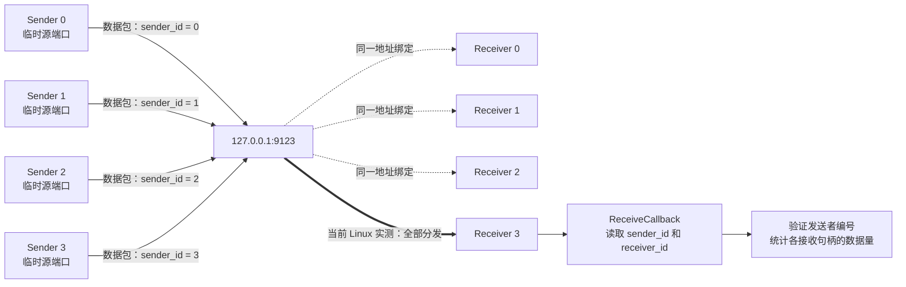

# 1.hello_world
最简单的libuv代码，创建事件循环，执行默认的事件循环，如果没有事件需要等待就结束，结束关闭事件循环，回收资源。

# 2.watcher_cross_stop
创建多个绑定到同一地址的 UDP 接收句柄，并用另一组使用临时源端口的
UDP 句柄发送包含自身编号的数据包。接收回调输出并验证发送者和接收者编号，
最后集中关闭所有句柄。

四个发送句柄没有绑定 `9123`，发送时由内核分配不同的临时源端口。四个
接收句柄通过 `UV_UDP_REUSEADDR` 绑定到同一个 `127.0.0.1:9123`。当前
Linux 环境中实测所有数据包都由最后绑定的 Receiver 3 接收，但该分发结果
不是 libuv 对所有操作系统作出的保证。
